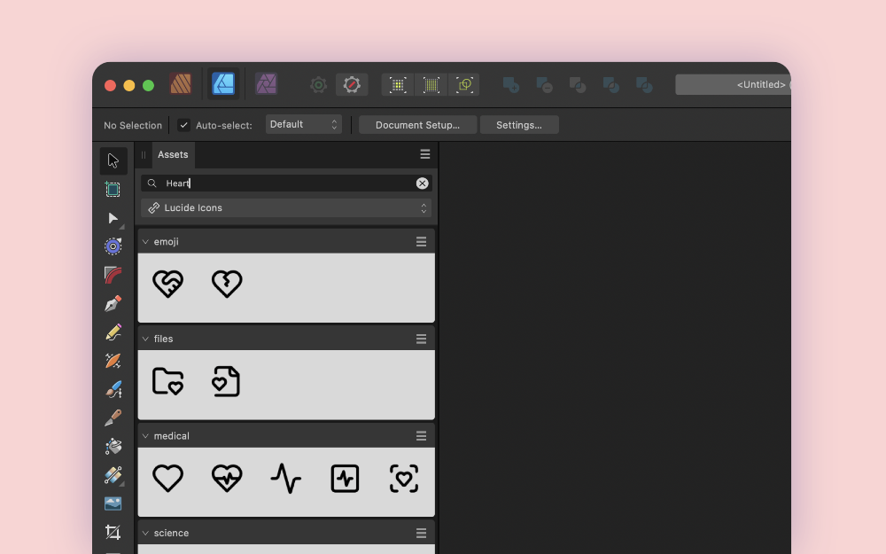

# Lucide Icons for Affinity __

A collection of [Lucide](https://lucide.dev) icons for Affinity Designer, Publisher and Photo. The icons are available as assets and can be easily dragged into your designs. All icons are in vector format and can be styled and scaled to any size.

### Screenshots

__
__

### Install

1. download the `lucide.afassets` file
2. in Affitity Designer, go to `Assets > Import Assets...` and select the file

### contribute

- feel free to reach out if you find issues or have suggestions

Have a great day, 
Yours, Robin

